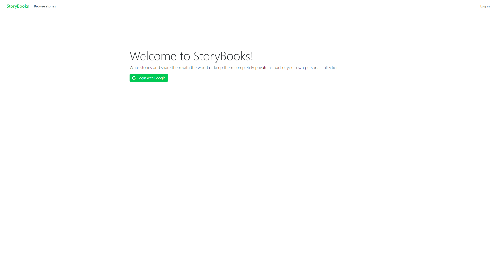
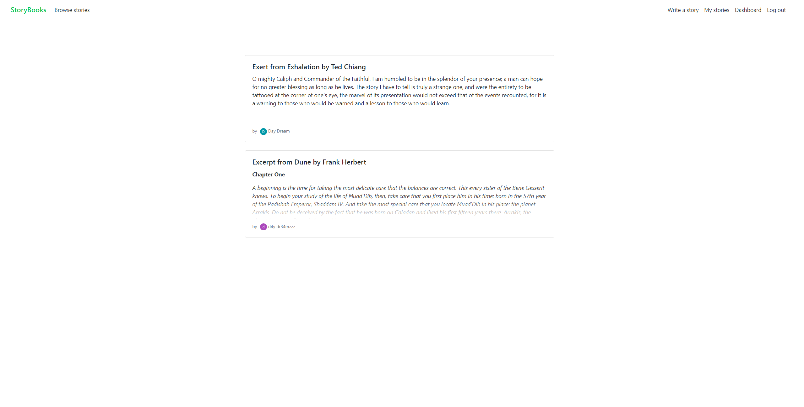
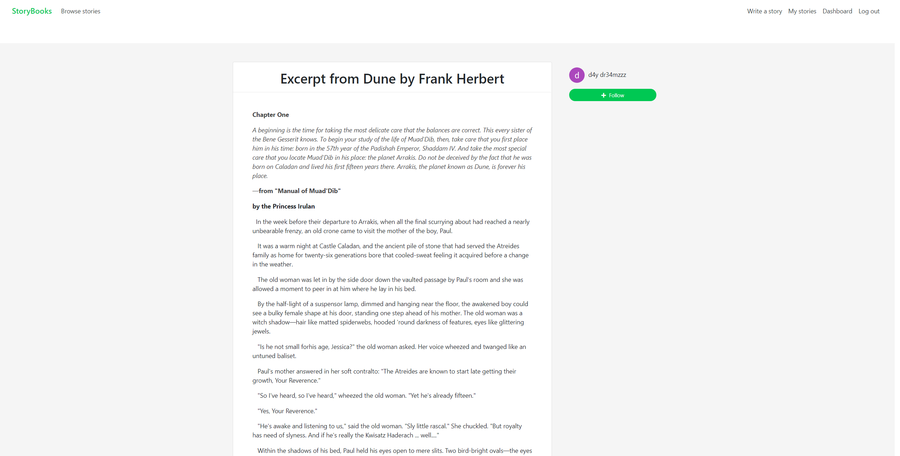
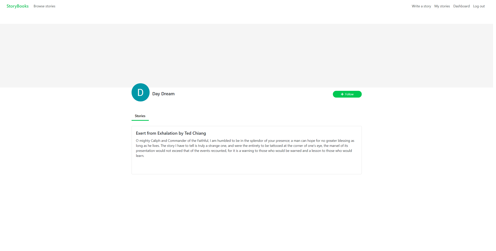

# :dragon: StoryBooks

The app provides users with a platform to share stories or to keep them private as part of their own personal collection; the project was completed as part of an [online video series](https://www.oreilly.com/library/view/nodejs-express-and/9781789535952/). A deployed version can be found [here](https://storybooks-production.herokuapp.com).

## Preface

### Tech stack
* HTML
* CSS
* Javascript
* Node.js + Express
* Handlebars
* Mongoose
* MongoDB

## Installation

### Requirements
You'll need to install the following before you can run the application:
* <a href="https://nodejs.org/en/" target="_blank">Node.js</a>
* <a href="https://www.mongodb.com/try/download/community" target="_blank">MongoDB</a>

### Set up

## Development

